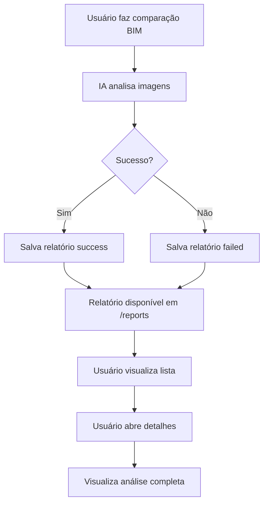

# 📊 Sistema de Relatórios BIM

Sistema completo de gerenciamento de relatórios de comparação BIM usando IA (Google Gemini Vision) com armazenamento no DynamoDB.

## 🎯 Funcionalidades

### ✅ Salvamento Automático
- Todos os relatórios de comparação BIM são salvos automaticamente no DynamoDB
- Armazena tanto comparações bem-sucedidas quanto com falha
- Inclui contexto fornecido pelo usuário
- Metadados completos (usuário, projeto, data)

### 📈 Página de Relatórios
- Lista todos os relatórios de um projeto selecionado
- **Estatísticas em tempo real:**
  - Total de relatórios
  - Relatórios bem-sucedidos
  - Relatórios com falha
  - Progresso médio da obra
- **Filtros avançados:**
  - Por status (sucesso/falha)
  - Busca por ID, contexto ou data
- Ordenação por data (mais recentes primeiro)

### 📄 Detalhes do Relatório
- Visualização completa da análise
- **Informações exibidas:**
  - Progresso da obra (percentual com gráfico circular)
  - Análise de conformidade (estrutura, dimensões, acabamento, posicionamento)
  - Problemas detectados (tipo, severidade, descrição)
  - Observações gerais
  - Recomendações
- Comparação lado a lado das imagens (BIM vs Obra)
- Contexto fornecido pelo usuário
- Metadados completos

## 🏗️ Arquitetura

### Estrutura DynamoDB

**Tabela:** `metro-bim-reports`

**Primary Key:**
- `reportId` (HASH) - ID único do relatório
- `projectId` (RANGE) - ID do projeto

**Global Secondary Index (GSI1):**
- `GSI1_PK` (HASH) - `project#<projectId>`
- `GSI1_SK` (RANGE) - Timestamp ISO
- **Propósito:** Query eficiente por projeto + ordenação por data

**Atributos:**
```javascript
{
  reportId: "rpt_1234567890_abc123",
  projectId: "proj_xyz",
  projectName: "Nome do Projeto",
  createdAt: "2025-01-15T10:30:00.000Z",
  status: "success", // ou "failed"
  
  // Imagens
  bimImage: {
    url: "https://...",
    fileName: "modelo-bim.jpg",
    category: "categoria2"
  },
  obraImage: {
    url: "https://...",
    fileName: "foto-obra.jpg",
    category: "categoria1"
  },
  
  // Contexto
  userContext: "Verificar pilares do subsolo...",
  
  // Resultado da IA
  analysisResult: {
    percentual_conclusao: 75,
    analise_progresso: "...",
    conformidade: {
      estrutura: "conforme",
      dimensoes: "conforme",
      acabamento: "não_conforme",
      posicionamento: "conforme"
    },
    problemas_detectados: [
      {
        tipo: "Acabamento incompleto",
        descricao: "...",
        severidade: "média"
      }
    ],
    observacoes_gerais: "...",
    recomendacoes: ["...", "..."]
  },
  
  // Índices
  GSI1_PK: "project#proj_xyz",
  GSI1_SK: "2025-01-15T10:30:00.000Z",
  
  // Metadados
  userId: "user_123",
  userName: "João Silva",
  
  // Erro (se status = failed)
  errorMessage: "Mensagem de erro..."
}
```

### Arquivos Criados

#### Services
- **`reportService.js`** - Serviço completo de gerenciamento de relatórios
  - `saveReport()` - Salvar novo relatório
  - `getProjectReports()` - Buscar relatórios de um projeto
  - `getReportById()` - Buscar relatório específico
  - `getProjectStats()` - Estatísticas do projeto
  - `deleteReport()` - Deletar relatório
  - `getProjectsWithReports()` - Listar projetos com relatórios

#### Pages
- **`Reports.jsx`** - Página de listagem de relatórios
  - Seletor de projeto
  - Cards de estatísticas
  - Filtros (status, busca)
  - Tabela de relatórios
  - Estados vazios e loading

- **`ReportDetails.jsx`** - Página de detalhes do relatório
  - Informações básicas
  - Contexto do usuário
  - Imagens comparadas
  - Gráfico circular de progresso
  - Análise de conformidade
  - Lista de problemas com severidade
  - Observações e recomendações

#### Styles
- **`Reports.css`** - Estilos da lista
- **`ReportDetails.css`** - Estilos dos detalhes

#### Scripts
- **`setup-reports-table.js`** - Script para criar tabela DynamoDB

#### Config
- **`aws-config.js`** - Adicionada constante `REPORTS_TABLE`

#### Routes
- `/reports` - Lista de relatórios
- `/reports/:reportId` - Detalhes do relatório

## 🚀 Setup

### 1. Criar Tabela DynamoDB

Execute o script de setup:

```bash
cd /Users/nicolasmavroucakis/Desenvolvimento/PI_Metro_2025/web
node scripts/setup-reports-table.js create
```

**Comandos disponíveis:**
```bash
node scripts/setup-reports-table.js create    # Criar tabela
node scripts/setup-reports-table.js delete    # Deletar tabela
node scripts/setup-reports-table.js check     # Verificar status
node scripts/setup-reports-table.js recreate  # Deletar e recriar
```

### 2. Configurar Variáveis de Ambiente

Adicione no arquivo `.env`:

```env
REACT_APP_REPORTS_TABLE=metro-bim-reports
```

### 3. Testar Sistema

1. Acesse um projeto
2. Clique em "🤖 Comparação IA"
3. Faça uma comparação
4. O relatório será salvo automaticamente
5. Acesse "📊 Relatórios" no menu
6. Selecione o projeto
7. Visualize as estatísticas
8. Clique em "👁️ Ver" para ver detalhes

## 📊 Fluxo de Uso



## 🔑 Queries Principais

### Query 1: Buscar relatórios por projeto
```javascript
// Usa GSI1 para buscar eficientemente
const result = await dynamoDB.query({
  TableName: 'metro-bim-reports',
  IndexName: 'GSI1',
  KeyConditionExpression: 'GSI1_PK = :pk',
  ExpressionAttributeValues: {
    ':pk': 'project#proj_xyz'
  },
  ScanIndexForward: false // Mais recentes primeiro
}).promise();
```

### Query 2: Buscar relatório específico
```javascript
// Usa chave primária para acesso direto
const result = await dynamoDB.get({
  TableName: 'metro-bim-reports',
  Key: {
    reportId: 'rpt_1234567890_abc123',
    projectId: 'proj_xyz'
  }
}).promise();
```

## 📈 Performance

- **Query por projeto:** ~10-50ms (usando GSI1)
- **Get por ID:** ~5-20ms (usando chave primária)
- **Capacidade:** 5 Read/Write Units (ajustar conforme uso)

## 🎨 Design

### Cores
- **Primary:** `#667eea` → `#764ba2` (gradiente roxo)
- **Sucesso:** `#4CAF50`
- **Falha:** `#F44336`
- **Progresso:** `#2196F3`

### Componentes
- Cards de estatísticas com ícones
- Tabela responsiva com badges de status
- Gráfico circular SVG para progresso
- Cards de conformidade com ícones
- Lista de problemas com indicadores de severidade
- Design totalmente responsivo

## ⚠️ Pontos de Atenção

### Segurança
- Credenciais AWS não devem estar commitadas
- Use `.env` para configurações sensíveis
- Valide permissões de acesso aos relatórios

### Performance
- Limite de 50-100 relatórios por query
- Para volumes maiores, implementar paginação
- GSI permite queries eficientes por projeto

### Custos AWS
- DynamoDB cobra por leitura/escrita
- 5 RCU/WCU é suficiente para testes
- Monitore uso no AWS Console
- Free tier: 25 GB + 25 RCU/WCU

## 🔮 Melhorias Futuras

### Curto Prazo
- [ ] Paginação para muitos relatórios
- [ ] Export para PDF
- [ ] Filtro por data
- [ ] Comparação entre relatórios

### Médio Prazo
- [ ] Gráficos de evolução do projeto
- [ ] Alertas automáticos para problemas críticos
- [ ] Integração com notificações
- [ ] Dashboard executivo

### Longo Prazo
- [ ] Machine Learning para predições
- [ ] Análise de tendências
- [ ] Recomendações inteligentes
- [ ] API para integração externa

## 📚 Documentação Relacionada

- [README_COMPARACAO_BIM.md](./README_COMPARACAO_BIM.md) - Sistema de comparação BIM
- [DYNAMODB_SETUP.md](./DYNAMODB_SETUP.md) - Setup geral do DynamoDB
- [README_DOCUMENTOS.md](../Mobile/README_DOCUMENTOS.md) - Sistema de documentos

## 🆘 Troubleshooting

### Relatório não está salvando
```javascript
// Verifique no console do navegador:
console.log('✅ Relatório salvo:', saveResult.reportId);
console.warn('⚠️ Erro ao salvar relatório:', saveResult.error);
```

### Tabela não encontrada
```bash
# Verifique se a tabela existe:
node scripts/setup-reports-table.js check

# Se não existir, crie:
node scripts/setup-reports-table.js create
```

### Permissões AWS
Certifique-se que suas credenciais têm permissões:
- `dynamodb:PutItem`
- `dynamodb:GetItem`
- `dynamodb:Query`
- `dynamodb:Scan`
- `dynamodb:DeleteItem`

### Erro ao calcular estatísticas
Se houver muitos relatórios, o scan pode demorar. Considere:
- Limitar o número de itens processados
- Cache das estatísticas
- Atualizar estatísticas incrementalmente

## ✅ Conclusão

Sistema completo e funcional de relatórios BIM integrado com:
- ✅ IA Google Gemini Vision
- ✅ DynamoDB para armazenamento
- ✅ Interface completa e responsiva
- ✅ Estatísticas em tempo real
- ✅ Filtros e busca
- ✅ Visualização detalhada
- ✅ Performance otimizada

---

**Desenvolvido para:** PI Metro 2025  
**Versão:** 1.0.0  
**Data:** Janeiro 2025

